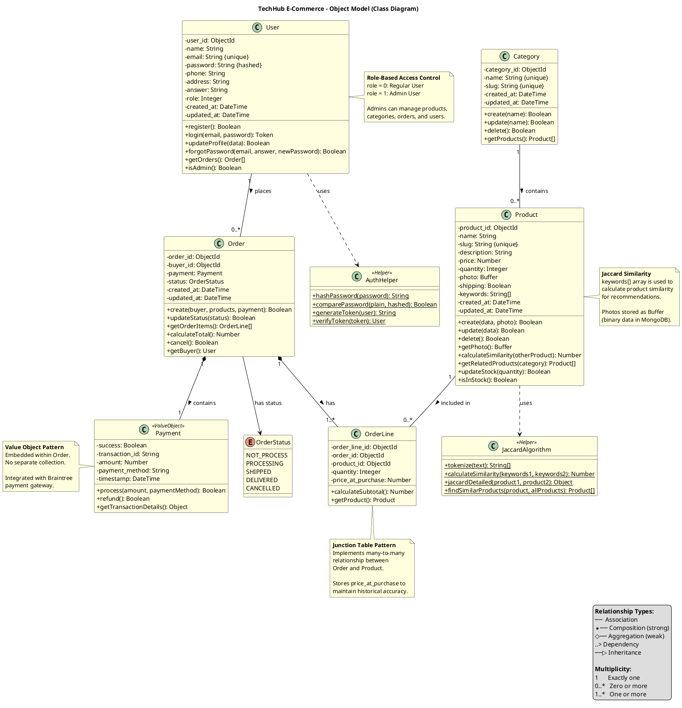

# Object Modeling - Class Diagram

# https://www.planttext.com/

## Overview
This document contains the Object Model (Class Diagram) for the TechHub E-Commerce system. It shows all the major classes, their attributes, methods, and relationships.

## Class Diagram



## How to View This Diagram

### In VS Code
1. Install "PlantUML" extension by jebbs
2. Copy the PlantUML code above
3. Create a `.puml` file and paste
4. Press `Alt+D` to preview

### Online
1. Go to: http://www.plantuml.com/plantuml/uml/
2. Copy the code between the \`\`\`plantuml tags
3. Paste and view

## Class Descriptions

### Core Domain Classes

#### **User**
Represents system users (customers and administrators).

**Key Attributes:**
- `role`: Integer (0 = customer, 1 = admin) for access control
- `password`: Hashed using Bcrypt for security
- `answer`: Security question answer for password recovery

**Key Methods:**
- `login()`: Authenticates user and returns JWT token
- `isAdmin()`: Checks if user has administrative privileges
- `getOrders()`: Retrieves user's order history

#### **Category**
Product categorization for organization and navigation.

**Key Attributes:**
- `slug`: URL-friendly identifier for SEO

**Key Methods:**
- `getProducts()`: Retrieves all products in this category

#### **Product**
Main product entity with full catalog information.

**Key Attributes:**
- `keywords[]`: Array of keywords for Jaccard similarity matching
- `photo`: Stored as Buffer (binary data) in MongoDB
- `quantity`: Current stock level

**Key Methods:**
- `calculateSimilarity()`: Uses Jaccard algorithm for product matching
- `getRelatedProducts()`: Returns similar products for recommendations
- `isInStock()`: Checks product availability

#### **Order**
Customer purchase order with payment and status tracking.

**Key Attributes:**
- `payment`: Embedded Payment object (composition)
- `status`: OrderStatus enum for lifecycle management

**Key Methods:**
- `calculateTotal()`: Sum of all order line subtotals
- `updateStatus()`: Transitions order through workflow
- `cancel()`: Cancels order if allowed by current status

#### **OrderLine**
Junction table implementing many-to-many relationship between Orders and Products.

**Key Attributes:**
- `price_at_purchase`: Preserves historical pricing
- `quantity`: Number of units ordered

**Key Methods:**
- `calculateSubtotal()`: quantity × price_at_purchase

### Value Objects

#### **Payment**
Embedded object within Order (no separate table).

**Attributes:**
- `success`: Payment transaction success status
- `transaction_id`: Braintree transaction identifier
- `amount`: Total payment amount

### Enumerations

#### **OrderStatus**
Order lifecycle states:
1. `NOT_PROCESS` - Order created, not yet processed
2. `PROCESSING` - Order being prepared
3. `SHIPPED` - Order dispatched for delivery
4. `DELIVERED` - Order successfully delivered
5. `CANCELLED` - Order cancelled

### Helper Classes

#### **AuthHelper**
Static utility class for authentication operations.

**Methods:**
- `hashPassword()`: Bcrypt hashing (10 salt rounds)
- `comparePassword()`: Verifies password against hash
- `generateToken()`: Creates JWT token
- `verifyToken()`: Validates and decodes JWT

#### **JaccardAlgorithm**
Static utility for product similarity calculations.

**Methods:**
- `calculateSimilarity()`: Computes Jaccard coefficient
  ```
  J(A,B) = |A ∩ B| / |A ∪ B|
  ```
- `findSimilarProducts()`: Returns sorted list of similar products

## Relationships Explained

### One-to-Many Relationships

1. **User → Order**
   - One user can place multiple orders
   - Each order belongs to exactly one user (buyer)

2. **Category → Product**
   - One category contains multiple products
   - Each product belongs to exactly one category

3. **Order → OrderLine**
   - One order contains one or more order lines
   - Each order line belongs to exactly one order
   - **Composition**: OrderLine cannot exist without Order

4. **Product → OrderLine**
   - One product can appear in multiple order lines
   - Each order line references exactly one product

### Composition vs Association

- **Composition** (filled diamond): Strong ownership
  - Order *owns* OrderLine
  - Order *owns* Payment
  - If Order is deleted, OrderLines and Payment are also deleted

- **Association** (line): Independent relationship
  - User is associated with Order, but deleting User doesn't delete Orders
  - Product is associated with OrderLine, but exists independently

### Dependency Relationships

- **Product depends on JaccardAlgorithm**: Uses it for similarity calculations
- **User depends on AuthHelper**: Uses it for authentication operations

## Design Patterns Used

### 1. **Junction Table Pattern** (OrderLine)
Resolves many-to-many relationship between Order and Product.

### 2. **Value Object Pattern** (Payment)
Embedded object with no identity of its own.

### 3. **Helper/Utility Pattern** (AuthHelper, JaccardAlgorithm)
Static utility classes providing cross-cutting functionality.

### 4. **Enumeration Pattern** (OrderStatus)
Type-safe status values.

## MongoDB Implementation Notes

### Schema Mapping

| UML Class | MongoDB Collection | Schema Technology |
|-----------|-------------------|-------------------|
| User | users | Mongoose Schema |
| Category | categories | Mongoose Schema |
| Product | products | Mongoose Schema |
| Order | orders | Mongoose Schema |
| OrderLine | Embedded in orders.products[] | Mongoose Array |
| Payment | Embedded in orders.payment | Mongoose Object |

### Special Considerations

1. **OrderLine Implementation**:
   - In MongoDB, stored as array in Order document
   - In relational DB, would be separate table

2. **Photo Storage**:
   - Stored as Buffer in MongoDB (binary data)
   - Alternative: Store URL to external storage (S3, Cloudinary)

3. **Keywords Array**:
   - Searchable array for Jaccard similarity
   - Indexed for performance

## Use Cases

This class diagram supports the following use cases:

1. **User Management**: Registration, login, profile updates
2. **Product Catalog**: Browse, search, filter products
3. **Shopping**: Add to cart, place orders, checkout
4. **Payment Processing**: Braintree integration
5. **Order Management**: Track orders, update status
6. **Admin Operations**: Manage users, products, categories, orders
7. **Recommendations**: Jaccard-based product suggestions

## Related Diagrams

- [SEQUENCE_DIAGRAM.md](SEQUENCE_DIAGRAM.md) - Shows interactions between these classes
- [DYNAMIC_MODELING.md](DYNAMIC_MODELING.md) - Shows state transitions for Order
- [DATABASE_SCHEMA.puml](DATABASE_SCHEMA.puml) - Database implementation of this model

---

**Last Updated:** 2025-11-23
**Diagram Type:** UML Class Diagram
**Purpose:** Object-Oriented Analysis and Design
