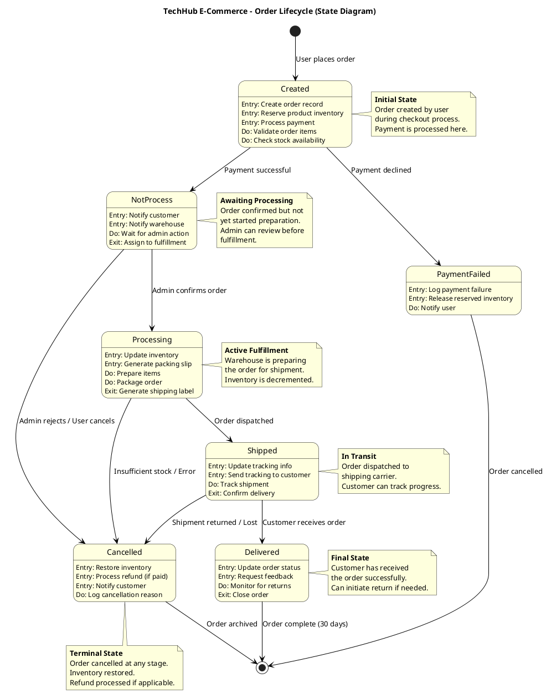
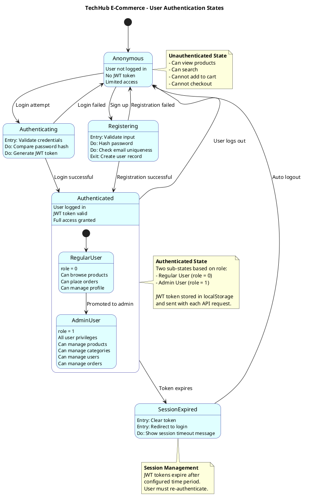
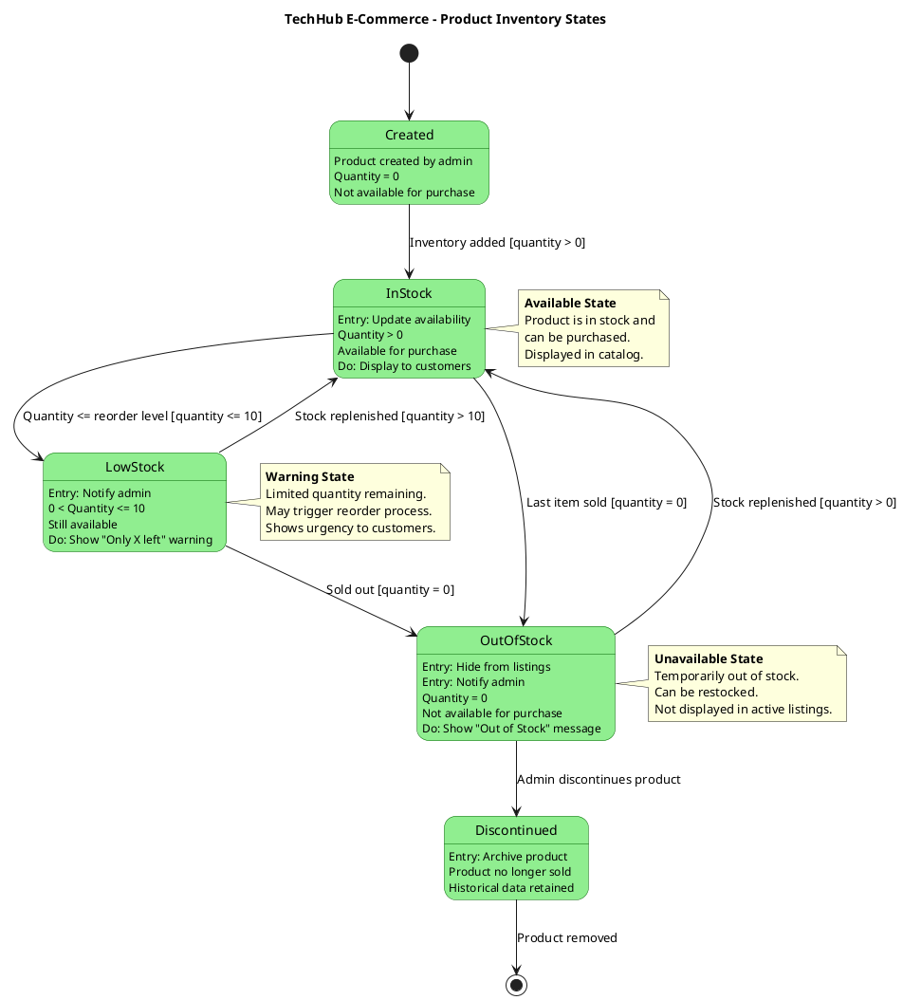

# Dynamic Modeling - State Diagram

## Overview
This document contains the Dynamic Model (State Diagram) for the TechHub E-Commerce system. It shows how objects change state in response to events, focusing on the Order lifecycle and User authentication states.

## State Diagrams

### 1. Order Lifecycle State Diagram



### 2. User Authentication State Diagram



### 3. Product Inventory State Diagram



## How to View These Diagrams

### In VS Code
1. Install "PlantUML" extension by jebbs
2. Copy each PlantUML code block
3. Create separate `.puml` files
4. Press `Alt+D` to preview

### Online
1. Go to: http://www.plantuml.com/plantuml/uml/
2. Copy code between \`\`\`plantuml tags
3. Paste and view

## State Diagram Explanations

### 1. Order Lifecycle State Diagram

This diagram models the complete lifecycle of an order from creation to completion or cancellation.

#### States Explained

| State | Description | Entry Actions | Activities | Exit Actions |
|-------|-------------|---------------|------------|--------------|
| **Created** | Order just placed | Create record, Reserve inventory, Process payment | Validate items, Check stock | - |
| **PaymentFailed** | Payment declined | Log failure, Release inventory | Notify user | - |
| **NotProcess** | Payment successful, awaiting processing | Notify customer & warehouse | Wait for admin action | Assign to fulfillment |
| **Processing** | Order being prepared | Update inventory, Generate packing slip | Prepare items, Package | Generate shipping label |
| **Shipped** | Order dispatched | Update tracking, Send to customer | Track shipment | Confirm delivery |
| **Delivered** | Order received by customer | Update status, Request feedback | Monitor for returns | Close order |
| **Cancelled** | Order cancelled | Restore inventory, Process refund, Notify customer | Log reason | - |

#### State Transitions

```
Created → NotProcess: Payment successful
Created → PaymentFailed: Payment declined

NotProcess → Processing: Admin confirms order
NotProcess → Cancelled: Admin/user cancels

Processing → Shipped: Order dispatched
Processing → Cancelled: Stock issues/errors

Shipped → Delivered: Customer receives
Shipped → Cancelled: Shipment returned/lost

Delivered → [Final]: Order complete (30 days)
Cancelled → [Final]: Order archived
```

#### Guard Conditions

- `[Payment successful]`: Payment processed by Braintree
- `[Sufficient stock]`: All items available in inventory
- `[Admin confirms]`: Admin approves order for fulfillment
- `[Customer receives]`: Delivery confirmation received

### 2. User Authentication State Diagram

Models user authentication lifecycle and role-based states.

#### States Explained

| State | Description | Token Status | Access Level |
|-------|-------------|--------------|--------------|
| **Anonymous** | Not logged in | No token | Public pages only |
| **Registering** | Creating new account | No token | Registration in progress |
| **Authenticating** | Logging in | Token generating | Login in progress |
| **Authenticated** | Logged in | Valid JWT token | Full access |
| **RegularUser** (sub-state) | Normal customer | Valid token, role=0 | Customer features |
| **AdminUser** (sub-state) | Administrator | Valid token, role=1 | Admin panel + customer features |
| **SessionExpired** | Token expired | Expired token | Redirected to login |

#### Composite State: Authenticated

The `Authenticated` state contains two sub-states:
- **RegularUser**: Default state for customers (role = 0)
- **AdminUser**: Elevated privileges for admins (role = 1)

A user can transition from RegularUser to AdminUser if promoted by another admin.

#### State Transitions

```
Anonymous → Authenticating: Login attempt
Anonymous → Registering: Sign up

Registering → Authenticated: Registration successful
Registering → Anonymous: Registration failed

Authenticating → Authenticated: Valid credentials
Authenticating → Anonymous: Invalid credentials

Authenticated → SessionExpired: Token expires
Authenticated → Anonymous: User logs out

SessionExpired → Anonymous: Auto logout
```

### 3. Product Inventory State Diagram

Models product availability based on stock levels.

#### States Explained

| State | Stock Level | Available | Displayed | Actions |
|-------|-------------|-----------|-----------|---------|
| **Created** | quantity = 0 | No | No | Initial state |
| **InStock** | quantity > 10 | Yes | Yes | Normal sales |
| **LowStock** | 0 < quantity ≤ 10 | Yes | Yes | Show urgency, notify admin |
| **OutOfStock** | quantity = 0 | No | No | Hide from catalog |
| **Discontinued** | N/A | No | No | Archived product |

#### State Transitions with Guards

```
Created → InStock: [quantity > 0]

InStock → LowStock: [quantity ≤ 10]
InStock → OutOfStock: [quantity = 0]

LowStock → InStock: [quantity > 10]
LowStock → OutOfStock: [quantity = 0]

OutOfStock → InStock: [Stock replenished]
OutOfStock → Discontinued: [Admin discontinues]
```

## UML State Diagram Notation

### State Syntax
```
state StateName {
    StateName : Entry: Action on entering state
    StateName : Do: Activity while in state
    StateName : Exit: Action on leaving state
}
```

### Symbols Used

| Symbol | Meaning |
|--------|---------|
| `[*]` | Initial/final pseudo-state |
| `-->` | Transition |
| `[condition]` | Guard condition |
| `/ action` | Action on transition |
| Entry | Action when entering state |
| Do | Ongoing activity in state |
| Exit | Action when leaving state |

## Implementation in Code

### Order Status in MongoDB

```javascript
// orderModel.js
const orderSchema = new mongoose.Schema({
    status: {
        type: String,
        enum: ['Not Process', 'Processing', 'Shipped', 'deliverd', 'cancel'],
        default: 'Not Process'
    }
});
```

### Order Status Controller

```javascript
// authController.js
export const orderStatusController = async (req, res) => {
    const { orderId } = req.params;
    const { status } = req.body;

    // State transition validation
    const validTransitions = {
        'Not Process': ['Processing', 'cancel'],
        'Processing': ['Shipped', 'cancel'],
        'Shipped': ['deliverd', 'cancel'],
        'deliverd': [], // Terminal state
        'cancel': [] // Terminal state
    };

    // Update order status with validation
    const order = await orderModel.findById(orderId);
    if (validTransitions[order.status].includes(status)) {
        order.status = status;
        await order.save();
    }
};
```

## Business Rules Encoded in States

### Order Lifecycle Rules

1. **Cannot ship unprocessed orders**: Must transition through Processing state
2. **Cannot cancel delivered orders**: Delivered is terminal state (use returns instead)
3. **Payment must succeed first**: PaymentFailed doesn't allow progression
4. **Inventory reserved during checkout**: Released on cancellation
5. **Refunds only for paid orders**: Checked in Cancelled state

### Authentication Rules

1. **JWT required for authenticated states**: Enforced by middleware
2. **Role determines access**: AdminUser sub-state grants extra privileges
3. **Session timeout automatic**: Token expiration triggers transition
4. **No session without login**: Must authenticate to access protected resources

### Inventory Rules

1. **Zero stock = not purchasable**: OutOfStock state prevents orders
2. **Low stock triggers alert**: LowStock state notifies admin
3. **Quantity tracked**: Each sale/return triggers potential state change
4. **Discontinued products retained**: Historical data preserved

## Related Diagrams

- [OBJECT_MODELING.md](OBJECT_MODELING.md) - Shows Order class with status attribute
- [SEQUENCE_DIAGRAM.md](SEQUENCE_DIAGRAM.md) - Shows how state transitions are triggered
- [PROCESS_MODELING.md](PROCESS_MODELING.md) - Shows business processes causing state changes

---

**Last Updated:** 2025-11-23
**Diagram Type:** UML State Diagram (State Machine Diagram)
**Purpose:** Behavioral Modeling - Object Lifecycles
