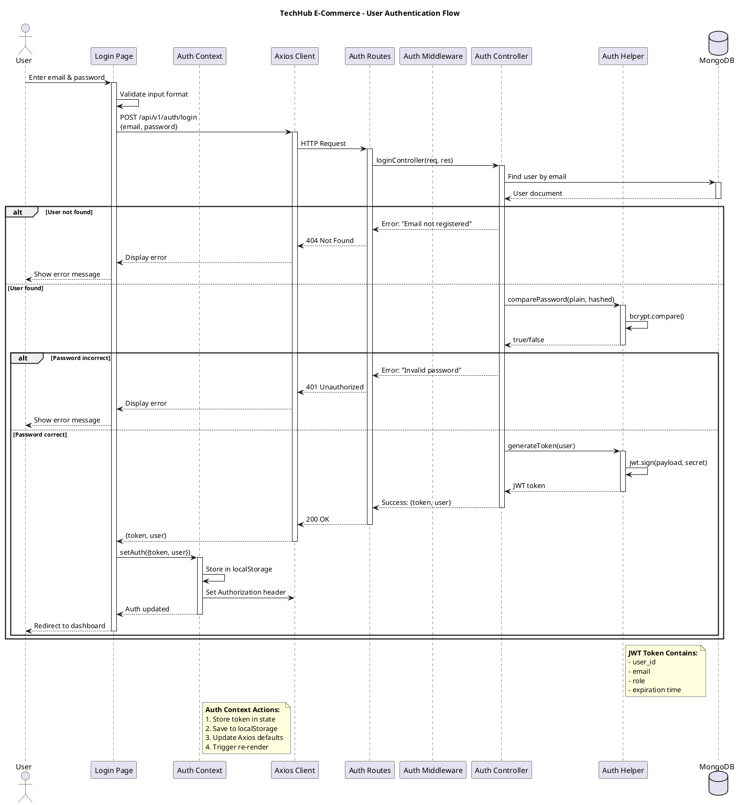
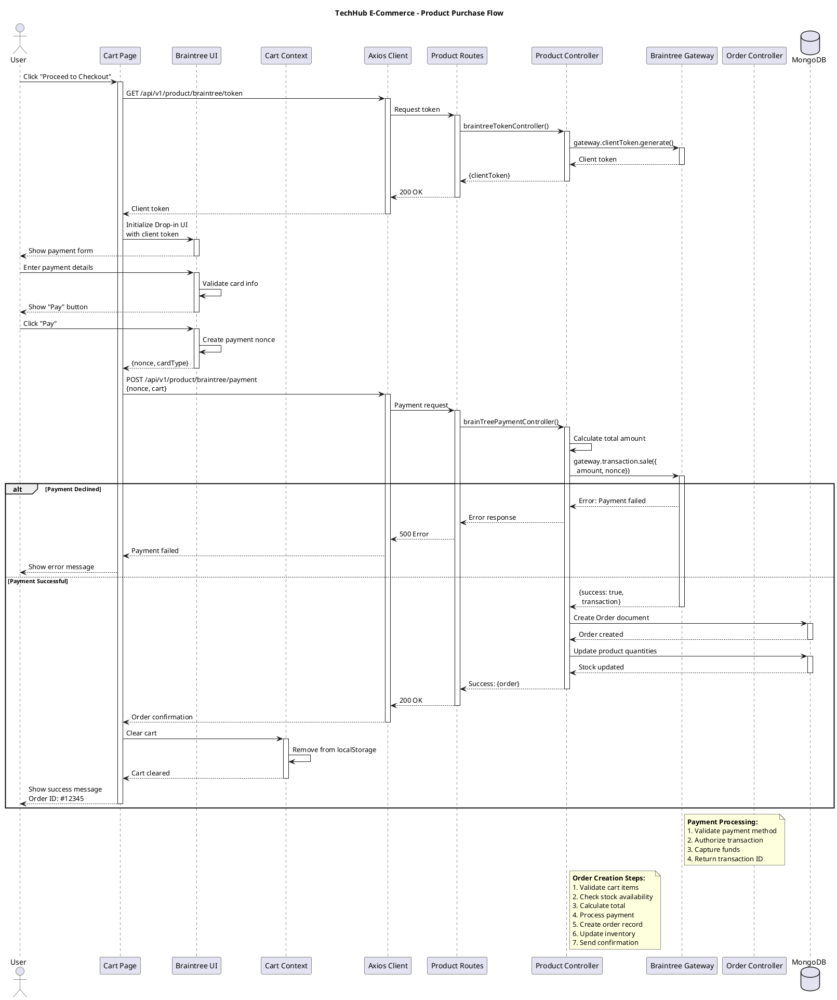
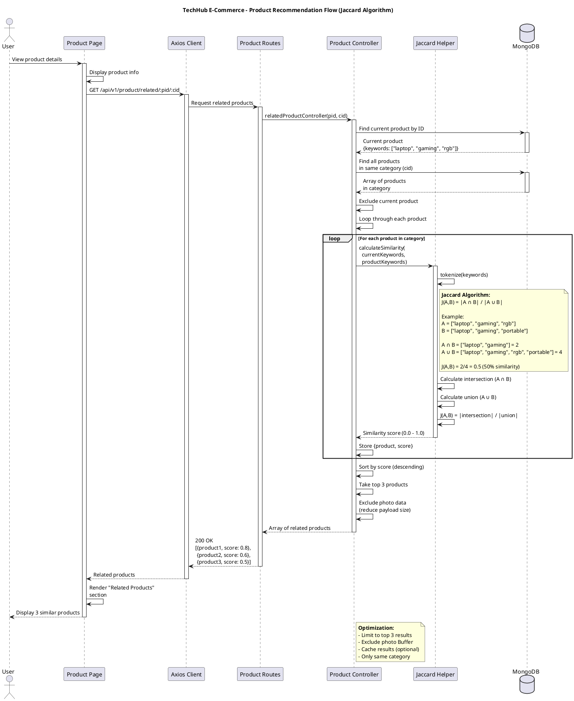
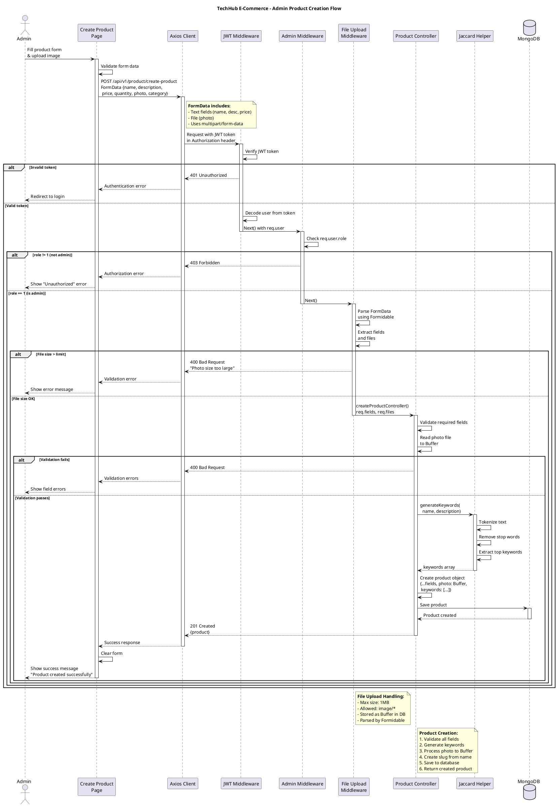
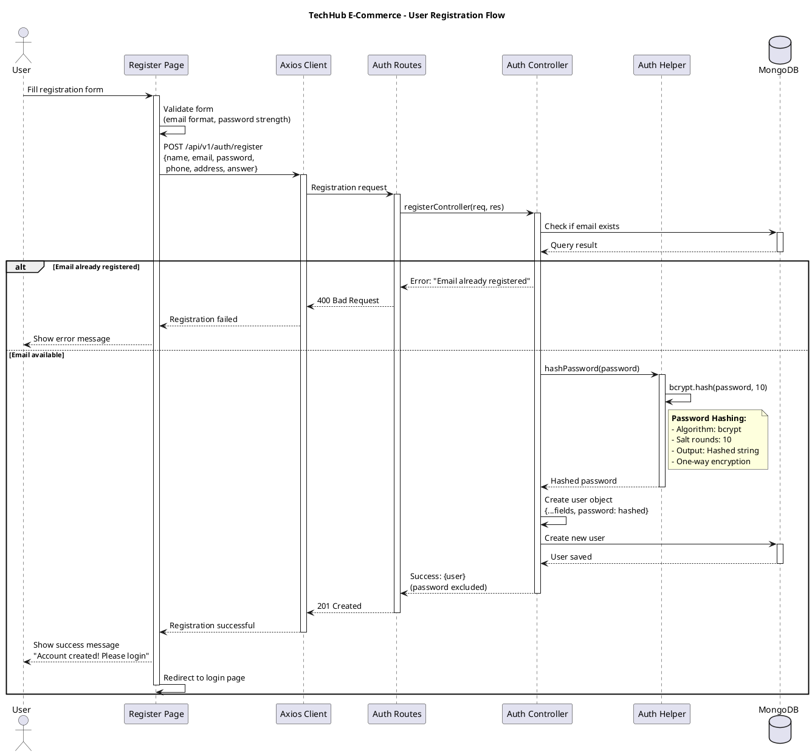

# Sequence Diagrams - Interaction Flows

## Overview
This document contains Sequence Diagrams for the TechHub E-Commerce system. These diagrams show how objects interact with each other over time to accomplish specific use cases.

## Sequence Diagrams

### 1. User Authentication (Login) Sequence



### 2. Product Purchase Flow (Checkout & Payment)



### 3. Product Recommendation (Jaccard Algorithm) Sequence



### 4. Admin Product Creation Sequence



### 5. User Registration Sequence



## How to View These Diagrams

### In VS Code
1. Install "PlantUML" extension by jebbs
2. Copy each PlantUML code block
3. Create separate `.puml` files
4. Press `Alt+D` to preview

### Online
1. Go to: http://www.plantuml.com/plantuml/uml/
2. Copy code between \`\`\`plantuml tags
3. Paste and view

## Sequence Diagram Explanations

### 1. User Authentication Sequence

**Purpose:** Shows the complete login flow from user input to authenticated session.

**Key Interactions:**
1. User enters credentials
2. Frontend validates format
3. Backend verifies against database
4. Password compared using Bcrypt
5. JWT token generated on success
6. Token stored in Auth Context and localStorage
7. Axios configured with Authorization header

**Security Measures:**
- Password hashed with Bcrypt (never plain text)
- JWT token for stateless authentication
- Token includes expiration time
- Failed attempts return appropriate error codes

### 2. Product Purchase Flow

**Purpose:** Complete e-commerce checkout process with payment integration.

**Key Interactions:**
1. User initiates checkout
2. Frontend requests Braintree client token
3. Braintree Drop-in UI initialized
4. User enters payment details
5. Payment nonce generated
6. Backend processes transaction via Braintree
7. Order created in database
8. Inventory updated
9. Cart cleared on success

**Payment Security:**
- Sensitive card data never touches our servers
- Braintree handles PCI compliance
- Payment nonce used for one-time transaction
- Transaction ID stored for record-keeping

**Error Handling:**
- Payment declined: Show error, keep cart
- Stock insufficient: Prevent order creation
- Network error: Retry mechanism

### 3. Product Recommendation Sequence

**Purpose:** Demonstrates Jaccard similarity algorithm for product recommendations.

**Key Interactions:**
1. User views product details
2. Frontend requests related products
3. Backend fetches current product's keywords
4. All products in same category retrieved
5. Jaccard similarity calculated for each
6. Results sorted by similarity score
7. Top 3 products returned
8. Frontend displays recommendations

**Jaccard Algorithm Details:**
```
J(A,B) = |A ∩ B| / |A ∪ B|

Where:
- A = Keywords of current product
- B = Keywords of comparison product
- ∩ = Intersection (common keywords)
- ∪ = Union (all unique keywords)

Score ranges from 0.0 (no similarity) to 1.0 (identical)
```

**Optimization:**
- Only compare within same category
- Exclude photo data (large Buffer)
- Limit to top 3 results
- Potential for caching

### 4. Admin Product Creation Sequence

**Purpose:** Shows multi-layered security and file upload handling.

**Key Interactions:**
1. Admin fills product form with image
2. FormData sent with multipart encoding
3. JWT middleware verifies authentication
4. Admin middleware checks role
5. File upload middleware parses FormData
6. Controller validates and processes
7. Jaccard helper generates keywords
8. Photo converted to Buffer
9. Product saved to database

**Middleware Chain:**
```
Request → JWT Verification → Admin Check → File Upload → Controller
```

**Security Layers:**
1. **Authentication**: JWT token required
2. **Authorization**: Admin role (role=1) required
3. **File Validation**: Size and type checks
4. **Input Validation**: Required fields, format checks

### 5. User Registration Sequence

**Purpose:** New user account creation with validation.

**Key Interactions:**
1. User fills registration form
2. Frontend validates format
3. Backend checks email uniqueness
4. Password hashed with Bcrypt
5. User record created
6. Success confirmation sent
7. Redirect to login page

**Validation Layers:**
- **Frontend**: Format, required fields
- **Backend**: Email uniqueness, data integrity
- **Database**: Schema validation

## UML Sequence Diagram Notation

### Symbols Used

| Symbol | Meaning |
|--------|---------|
| `actor` | Human user |
| `participant` | System component |
| `database` | Database |
| `->` | Synchronous message |
| `-->` | Return message |
| `activate`/`deactivate` | Lifeline activation |
| `alt`/`else`/`end` | Alternative paths |
| `loop`/`end` | Iteration |
| `note` | Explanatory note |

### Message Types

- **Solid arrow (→)**: Synchronous call (waits for response)
- **Dashed arrow (-->)**: Return value
- **Self-call**: Component calling its own method

## Common Patterns Observed

### 1. Three-Tier Request Pattern
```
UI → Axios → Routes → Controller → Database
```

### 2. Authentication Pattern
```
Request → JWT Middleware → Check Token → Extract User → Continue
```

### 3. Authorization Pattern
```
Authenticated Request → Admin Middleware → Check Role → Continue/Reject
```

### 4. Error Handling Pattern
```
alt Success Path
    Return success response
else Error Path
    Return error response with status code
end
```

## Performance Considerations

### Async Operations
- Database queries are asynchronous
- Payment processing may take time
- File uploads can be slow for large images

### Optimization Strategies
1. **Caching**: Store frequently accessed data (categories, products)
2. **Pagination**: Limit product lists (12 per page)
3. **Lazy Loading**: Load images only when needed
4. **Debouncing**: Search input delays
5. **Indexing**: Database indexes on frequently queried fields

## Related Diagrams

- [OBJECT_MODELING.md](OBJECT_MODELING.md) - Shows classes involved in these interactions
- [DYNAMIC_MODELING.md](DYNAMIC_MODELING.md) - Shows state changes triggered by these interactions
- [PROCESS_MODELING.md](PROCESS_MODELING.md) - Shows business processes behind these interactions

---

**Last Updated:** 2025-11-23
**Diagram Type:** UML Sequence Diagram
**Purpose:** Interaction Modeling - Showing Object Collaboration Over Time
