# Process Modeling - Activity Diagrams

## Overview
This document contains Activity Diagrams for the TechHub E-Commerce system. These diagrams model business processes and workflows, showing the flow of control and data through activities.

## Activity Diagrams

### 1. Order Processing Workflow


### 2. User Registration Process


### 3. Product Search and Filter Process


### 4. Admin Product Creation Process


### 5. Order Status Update Process (Admin)

```plantuml
@startuml Order_Status_Update_Activity

title TechHub E-Commerce - Order Status Update Process

|Admin|
start
:Navigate to "Manage Orders";

|#LightBlue|System|
:Fetch all orders;
:Display orders table;

|Admin|
:Select an order;
:View order details;

partition "Order Information" {
    :Customer info;
    :Order items;
    :Payment status;
    :Current status;
    :Timestamps;
}

:Select new status from dropdown;
note right
  Status Options:
  - Not Process
  - Processing
  - Shipped
  - Delivered
  - Cancelled
end note

|#LightBlue|System|
:Validate status transition;

if (Valid transition?) then (yes)
    note right
      Valid Transitions:
      Not Process → Processing, Cancelled
      Processing → Shipped, Cancelled
      Shipped → Delivered, Cancelled
      Delivered → (no change)
      Cancelled → (no change)
    end note

    if (New status = "Cancelled"?) then (yes)
        :Restore product inventory;
        :Process refund (if paid);
        :Send cancellation email;
    elseif (New status = "Shipped"?) then (yes)
        :Update tracking information;
        :Send shipping confirmation;
    elseif (New status = "Delivered"?) then (yes)
        :Send delivery confirmation;
        :Request customer feedback;
    endif

    :Update order status in DB;
    :Log status change;
    :Timestamp update;

    |Admin|
    :Show success message;
    :Updated status displayed;

    fork
        :Update another order;
        detach
    fork again
        :View order analytics;
        stop
    end fork

else (no)
    |Admin|
    :Show "Invalid transition" error;
    :Keep current status;
    stop
endif

@enduml
```



### 6. Product Recommendation Generation Process

```plantuml
@startuml Product_Recommendation_Activity

title TechHub E-Commerce - Product Recommendation Generation (Jaccard)

|System|
start
:User views product page;
:Load product details;

partition "Fetch Related Products" {
    :Get current product ID (pid);
    :Get current category ID (cid);
    :Fetch current product from DB;
    :Extract keywords array;
    note right
      Keywords example:
      ["laptop", "gaming",
       "rgb", "high-performance"]
    end note

    :Fetch all products in category;
    :Exclude current product;
}

partition "Calculate Similarity" #LightGreen {
    :Initialize empty results array;

    repeat
        :Get next product from list;
        :Extract comparison keywords;

        partition "Jaccard Algorithm" {
            :Tokenize keywords;
            :Calculate intersection (A ∩ B);
            note right
              Intersection:
              Common keywords
              between two products
            end note

            :Calculate union (A ∪ B);
            note right
              Union:
              All unique keywords
              from both products
            end note

            :Compute J(A,B) = |A ∩ B| / |A ∪ B|;
            note right
              Jaccard Coefficient:
              Score from 0.0 to 1.0
              1.0 = identical
              0.0 = no similarity
            end note
        }

        :Store {product, score};

    repeat while (More products?) is (yes)
    ->no;
}

:Sort by similarity score (DESC);
:Take top 3 products;
:Exclude photo data\n(reduce payload);
:Return related products;

|Customer|
:Display "Related Products" section;
:Show 3 similar products;

if (Customer clicks on\nrelated product?) then (yes)
    :Navigate to new product page;
    :Repeat recommendation process;
    detach
else (no)
    stop
endif

@enduml
```



## How to View These Diagrams

### In VS Code
1. Install "PlantUML" extension by jebbs
2. Copy each PlantUML code block
3. Create separate `.puml` files
4. Press `Alt+D` to preview

### Online
1. Go to: http://www.plantuml.com/plantuml/uml/
2. Copy code between \`\`\`plantuml tags
3. Paste and view

## Activity Diagram Explanations

### 1. Order Processing Workflow

**Purpose:** Complete end-to-end order fulfillment process.

**Swimlanes:**
- **Customer**: User actions
- **System**: Automated system processes
- **Payment Gateway**: Braintree payment processing
- **Admin**: Administrative tasks
- **Shipping Carrier**: External delivery service

**Key Decision Points:**
1. **Stock Availability**: Prevents overselling
2. **Payment Success**: Gates order creation
3. **Admin Approval**: Quality control step
4. **Delivery Confirmation**: Final state transition

**Business Rules:**
- Inventory decremented only after successful payment
- Refund processed automatically on cancellation
- Customer notified at each major status change

### 2. User Registration Process

**Purpose:** New user account creation with validation.

**Validation Layers:**
1. **Frontend**: Format, required fields, password strength
2. **Backend**: Email uniqueness, data integrity
3. **Database**: Schema validation

**Security Measures:**
- Password hashed before storage (Bcrypt, 10 rounds)
- Email uniqueness enforced
- Security question for password recovery

**Error Handling:**
- Duplicate email: Suggest login or reset
- Validation failure: Show specific errors
- Server error: Generic error message

### 3. Product Search and Filter Process

**Purpose:** Multi-criteria product discovery.

**Concurrent Activities (fork):**
- Search by keyword
- Filter by category
- Filter by price range

**Query Building:**
- Dynamic query construction based on provided criteria
- Regex search on name and description
- Price range filtering
- Category matching

**Performance Optimization:**
- Pagination (12 products per page)
- Photo data excluded from list view
- Lazy loading for images

**User Actions After Results:**
- View product details
- Adjust filters (refresh)
- Load more products (pagination)
- Add to cart

### 4. Admin Product Creation Process

**Purpose:** Secure product catalog management.

**Security Layers:**
1. **Authentication**: JWT token required
2. **Authorization**: Admin role check (role=1)
3. **Validation**: Input and file validation

**Process Steps:**
1. Form validation (frontend)
2. Authentication verification (JWT)
3. Authorization check (admin role)
4. File parsing (Formidable)
5. Data processing (slug, keywords, photo Buffer)
6. Database persistence

**Keyword Generation:**
- Tokenize name and description
- Remove common stop words ("the", "and", "or", etc.)
- Extract top 15 relevant keywords
- Used for Jaccard similarity

### 5. Order Status Update Process

**Purpose:** Admin-controlled order lifecycle management.

**Valid Status Transitions:**
```
Not Process → {Processing, Cancelled}
Processing  → {Shipped, Cancelled}
Shipped     → {Delivered, Cancelled}
Delivered   → (Terminal - no changes)
Cancelled   → (Terminal - no changes)
```

**Status-Specific Actions:**
- **Cancelled**: Restore inventory, process refund, notify customer
- **Shipped**: Update tracking, send shipping confirmation
- **Delivered**: Send confirmation, request feedback

**Audit Trail:**
- Every status change logged
- Timestamp recorded
- Admin user tracked (in full implementation)

### 6. Product Recommendation Generation

**Purpose:** Intelligent product suggestions using Jaccard similarity.

**Algorithm Steps:**
1. Extract keywords from current product
2. Fetch all products in same category
3. For each product:
   - Tokenize keywords
   - Calculate intersection: common keywords
   - Calculate union: all unique keywords
   - Compute Jaccard coefficient: J(A,B) = |A∩B| / |A∪B|
4. Sort by similarity score (descending)
5. Return top 3 products

**Jaccard Example:**
```
Product A: ["laptop", "gaming", "rgb", "portable"]
Product B: ["laptop", "gaming", "business", "lightweight"]

Intersection (A ∩ B): ["laptop", "gaming"] = 2 elements
Union (A ∪ B): ["laptop", "gaming", "rgb", "portable",
                "business", "lightweight"] = 6 elements

J(A,B) = 2/6 = 0.333 (33.3% similarity)
```

## UML Activity Diagram Notation

### Symbols Used

| Symbol | Meaning |
|--------|---------|
| Circle (filled) | Start node |
| Circle (filled with border) | End node |
| Rounded rectangle | Activity/Action |
| Diamond | Decision point |
| Horizontal bars | Fork/Join (parallel activities) |
| Rectangle with vertical lines | Swimlane (actor/system) |
| Note | Additional information |

### Control Flow

- **Solid arrow**: Sequential flow
- **Diamond**: Decision (if/else)
- **Fork bars**: Parallel execution
- **Join bars**: Synchronization point

## Business Process Improvements

### Current Implementation
✅ Stock validation before order creation
✅ Automated inventory updates
✅ Email notifications at key points
✅ Role-based access control
✅ Payment integration
✅ Intelligent recommendations

### Potential Enhancements
🔄 Real-time inventory sync across multiple warehouses
🔄 Automated reorder when stock falls below threshold
🔄 Customer notification system (SMS, Push)
🔄 Advanced analytics dashboard
🔄 AI-powered product recommendations (beyond Jaccard)
🔄 Multi-currency support
🔄 Bulk operations for admin (bulk status update)

## Process Metrics

### Key Performance Indicators (KPIs)

1. **Order Processing Time**: Time from order placed to shipped
2. **Payment Success Rate**: Percentage of successful transactions
3. **Cart Abandonment Rate**: Checkouts started but not completed
4. **Search Relevance**: Click-through rate on search results
5. **Recommendation Accuracy**: Purchases from recommended products
6. **Admin Efficiency**: Time to process orders

### Bottlenecks to Monitor

- Payment gateway response time
- Database query performance (search, filters)
- Image upload/processing time
- Inventory synchronization delays
- Email delivery delays

## Related Diagrams

- [SEQUENCE_DIAGRAM.md](SEQUENCE_DIAGRAM.md) - Shows detailed interactions within these processes
- [DYNAMIC_MODELING.md](DYNAMIC_MODELING.md) - Shows state changes caused by these processes
- [OBJECT_MODELING.md](OBJECT_MODELING.md) - Shows objects involved in these processes

---

**Last Updated:** 2025-11-23
**Diagram Type:** UML Activity Diagram
**Purpose:** Business Process Modeling - Workflow and Control Flow
