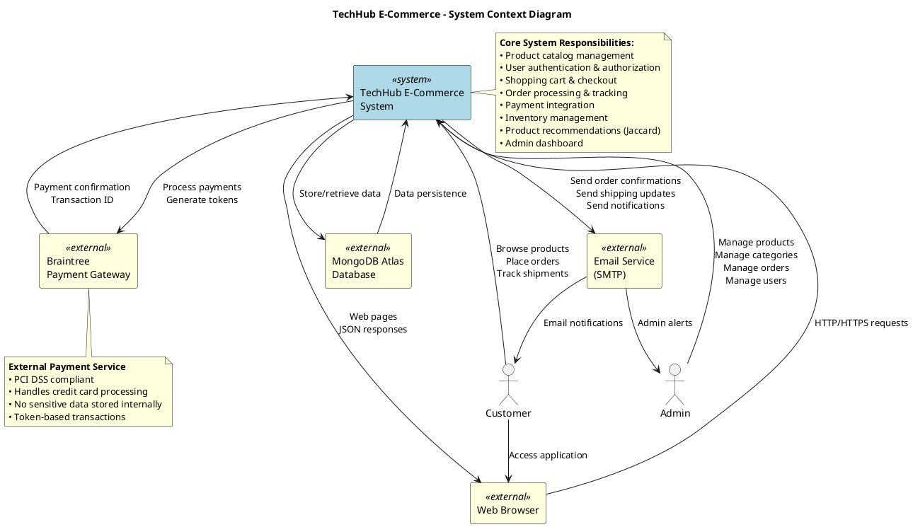
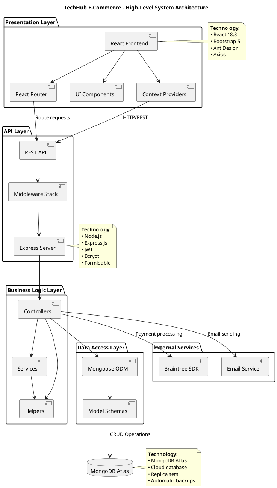
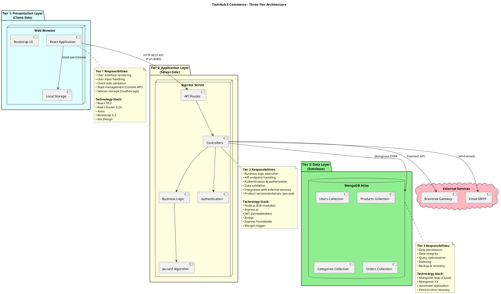
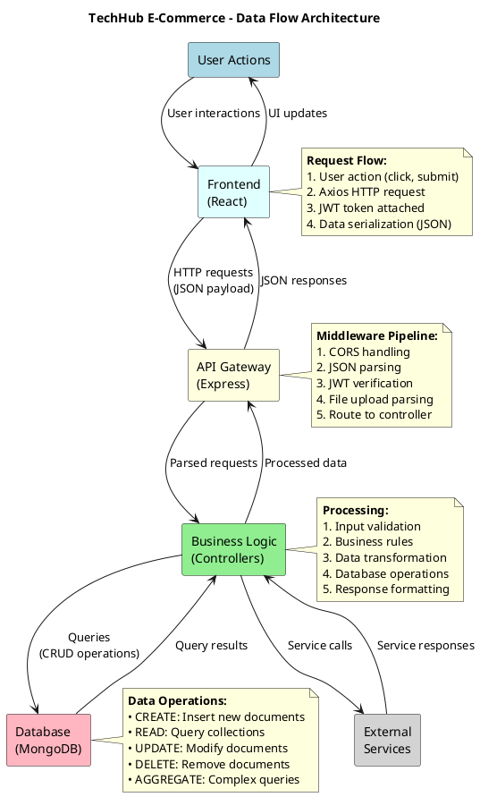
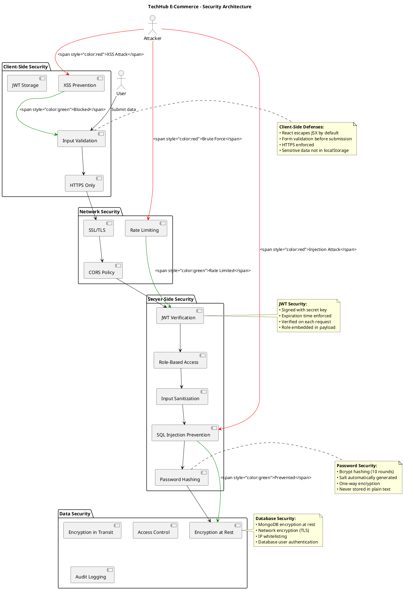

# System Design - High-Level Architecture

## Overview
This document contains the System Design diagrams for the TechHub E-Commerce platform. It shows the high-level architecture, system boundaries, external interfaces, and technology stack.

## System Design Diagrams

### 1. System Context Diagram



### 2. High-Level System Architecture



### 3. Three-Tier Architecture



### 4. Data Flow Architecture



### 5. Security Architecture



## How to View These Diagrams

### In VS Code
1. Install "PlantUML" extension by jebbs
2. Copy each PlantUML code block
3. Create separate `.puml` files
4. Press `Alt+D` to preview

### Online
1. Go to: http://www.plantuml.com/plantuml/uml/
2. Copy code between \`\`\`plantuml tags
3. Paste and view

## System Design Explanations

### 1. System Context Diagram

**Purpose:** Shows the system boundaries and external interactions.

**Actors:**
- **Customer**: End users who browse and purchase products
- **Admin**: System administrators who manage the platform

**External Systems:**
- **Braintree Payment Gateway**: PCI-compliant payment processing
- **Email Service (SMTP)**: Notification delivery
- **MongoDB Atlas**: Cloud database service
- **Web Browser**: Client access point

**System Boundaries:**
The TechHub E-Commerce System encompasses:
- Frontend React application
- Backend Express API
- Business logic and services
- Authentication and authorization
- Product recommendation engine (Jaccard)

**External Dependencies:**
All external services are replaceable:
- Braintree → Stripe, PayPal
- SMTP → SendGrid, AWS SES
- MongoDB Atlas → Self-hosted MongoDB, PostgreSQL

### 2. High-Level System Architecture

**Purpose:** Shows major architectural components and their relationships.

**Layered Architecture:**

1. **Presentation Layer**
   - React components
   - Routing
   - State management (Context API)
   - UI rendering

2. **API Layer**
   - Express server
   - REST API endpoints
   - Middleware stack (CORS, JWT, File upload)
   - Request/response handling

3. **Business Logic Layer**
   - Controllers (route handlers)
   - Services (reusable business logic)
   - Helpers (utility functions)
   - Jaccard recommendation algorithm

4. **Data Access Layer**
   - Mongoose ODM
   - Schema definitions
   - Query builders
   - Database connections

**Separation of Concerns:**
Each layer has a specific responsibility, allowing:
- Independent testing
- Technology replacement
- Scalability
- Maintainability

### 3. Three-Tier Architecture

**Purpose:** Classic three-tier pattern for scalability and separation.

**Tier 1: Presentation (Client-Side)**
- **Location**: User's web browser
- **Technology**: React, Bootstrap, Ant Design
- **Responsibilities**: UI rendering, user input, client-side validation
- **State Management**: Context API + localStorage
- **Communication**: HTTP REST API to Tier 2

**Tier 2: Application (Server-Side)**
- **Location**: Node.js server (Port 8080)
- **Technology**: Express.js, JWT, Bcrypt
- **Responsibilities**: Business logic, authentication, data processing
- **API**: RESTful endpoints at `/api/v1/*`
- **Communication**: Mongoose ODM to Tier 3

**Tier 3: Data (Database)**
- **Location**: MongoDB Atlas (Cloud)
- **Technology**: MongoDB, Mongoose
- **Responsibilities**: Data persistence, integrity, querying
- **Collections**: users, products, categories, orders
- **Backup**: Automatic cloud backups

**Benefits:**
- ✅ Scalability: Each tier can scale independently
- ✅ Security: Database not directly accessible from client
- ✅ Maintainability: Clear separation of concerns
- ✅ Flexibility: Technology changes isolated to specific tier

### 4. Data Flow Architecture

**Purpose:** Shows how data moves through the system.

**Request Flow (Client → Server):**
```
1. User Action (e.g., "Add to Cart")
2. React component triggers Axios request
3. JWT token attached to Authorization header
4. HTTP POST request to /api/v1/product/...
5. Express receives and parses request
6. CORS middleware validates origin
7. JWT middleware verifies token
8. Controller executes business logic
9. Mongoose queries MongoDB
10. Database returns results
```

**Response Flow (Server → Client):**
```
1. Controller processes database results
2. Data formatted as JSON
3. HTTP response with status code
4. Axios receives response
5. React state updated (Context/useState)
6. Component re-renders
7. UI updates visible to user
```

**Data Transformations:**
- **Client → Server**: Form data → JSON → Buffer (images)
- **Server → Database**: JSON → BSON (MongoDB format)
- **Database → Server**: BSON → JSON
- **Server → Client**: JSON → JavaScript objects → React state

### 5. Security Architecture

**Purpose:** Multi-layered defense-in-depth security approach.

**Security Layers:**

1. **Client-Side Security**
   - Input validation (format, length, type)
   - XSS prevention (React escapes JSX)
   - HTTPS enforcement
   - Secure JWT storage (not in cookies if vulnerable)

2. **Network Security**
   - CORS policy (whitelist origins)
   - SSL/TLS encryption in transit
   - Rate limiting (prevent brute force)
   - Request size limits

3. **Server-Side Security**
   - JWT verification on protected routes
   - Role-based access control (RBAC)
   - Input sanitization and validation
   - NoSQL injection prevention (Mongoose escaping)
   - Bcrypt password hashing

4. **Data Security**
   - Encryption at rest (MongoDB Atlas)
   - Encryption in transit (TLS)
   - Database access control (IP whitelist)
   - Audit logging (request logs)

**Attack Prevention:**

| Attack Type | Prevention Method |
|-------------|-------------------|
| XSS | React JSX escaping, Content Security Policy |
| CSRF | JWT tokens (not cookies), SameSite cookies |
| SQL Injection | Mongoose parameterized queries |
| Brute Force | Rate limiting, account lockout |
| Man-in-Middle | HTTPS/TLS encryption |
| Session Hijacking | JWT expiration, secure storage |
| Unauthorized Access | JWT verification + role checks |

## System Scalability

### Horizontal Scaling

**Frontend:**
- Static files served via CDN
- Multiple instances behind load balancer
- Stateless design (JWT tokens)

**Backend:**
- Multiple Express server instances
- Load balancer distribution
- Stateless API (no session storage)

**Database:**
- MongoDB replica sets
- Read replicas for scaling reads
- Sharding for scaling writes

### Vertical Scaling

- Increase server CPU/RAM
- Optimize database queries
- Add indexes to collections
- Cache frequently accessed data

### Caching Strategy

**Client-Side:**
- localStorage for cart and auth
- Browser cache for static assets
- Service workers (optional PWA)

**Server-Side:**
- Redis for session data (if needed)
- In-memory caching for categories
- Query result caching

**Database:**
- MongoDB built-in caching
- Index optimization
- Aggregation pipeline

## System Monitoring

### Application Monitoring
- Request/response logging (Morgan)
- Error tracking and alerting
- Performance metrics (response times)
- API endpoint usage statistics

### Infrastructure Monitoring
- Server CPU, memory, disk usage
- Network latency
- Database query performance
- External service availability (Braintree, SMTP)

### Business Metrics
- Order completion rate
- Payment success rate
- Search result relevance
- Recommendation click-through rate
- Cart abandonment rate

## Disaster Recovery

### Backup Strategy
- **Database**: Automatic daily backups (MongoDB Atlas)
- **Code**: Git version control
- **Configuration**: Environment variable documentation
- **Media**: Product images in database (Buffer)

### Recovery Time Objective (RTO)
- Database restore: < 1 hour (MongoDB Atlas)
- Application deployment: < 30 minutes
- Total system recovery: < 2 hours

### Recovery Point Objective (RPO)
- Maximum data loss: 24 hours (daily backups)
- Transaction logs: Real-time replication

## Technology Stack Summary

| Layer | Technology | Purpose |
|-------|-----------|---------|
| **Frontend** | React 18.3 | UI framework |
| | React Router 6.29 | Client-side routing |
| | Axios | HTTP client |
| | Bootstrap 5.3 | CSS framework |
| | Ant Design | UI components |
| **Backend** | Node.js | Runtime environment |
| | Express.js | Web framework |
| | JWT | Authentication |
| | Bcrypt | Password hashing |
| | Formidable | File uploads |
| | Morgan | Request logging |
| **Database** | MongoDB Atlas | NoSQL database |
| | Mongoose 7.x | ODM |
| **External** | Braintree | Payment gateway |
| | SMTP | Email service |
| **DevOps** | Nodemon | Development auto-reload |
| | Concurrently | Run multiple processes |
| | Git | Version control |

## Related Diagrams

- [COMPONENT_DIAGRAM.md](COMPONENT_DIAGRAM.md) - Detailed component relationships
- [DEPLOYMENT_DIAGRAM.md](DEPLOYMENT_DIAGRAM.md) - Infrastructure and deployment
- [ARCHITECTURE_DIAGRAM.puml](ARCHITECTURE_DIAGRAM.puml) - System architecture variations

---

**Last Updated:** 2025-11-23
**Diagram Type:** System Design / Architecture Diagrams
**Purpose:** High-Level System Design and Architecture Documentation
