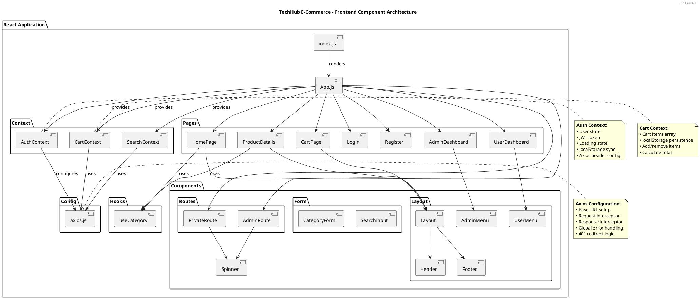
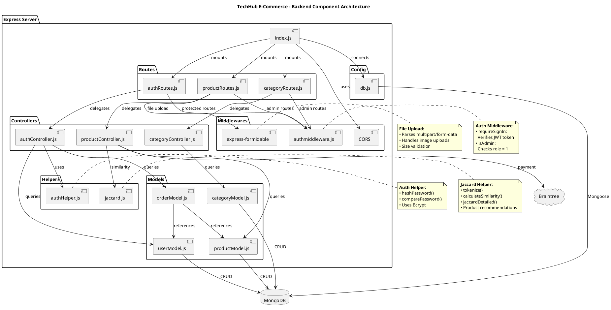
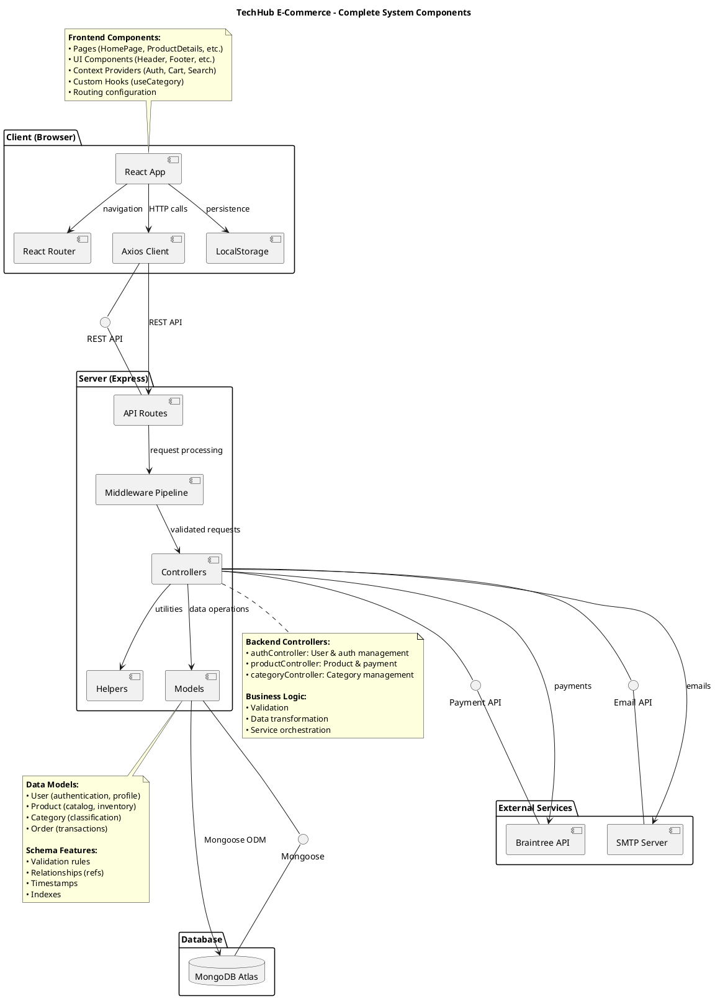
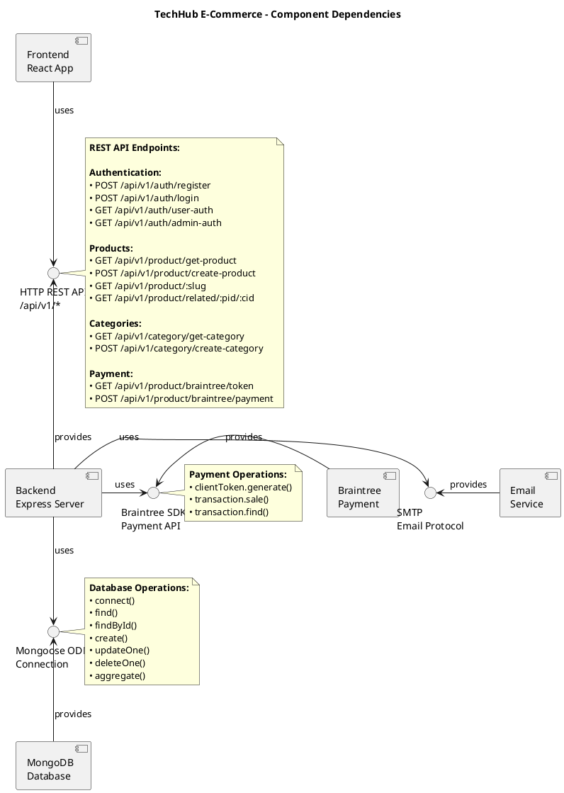

# Component Diagram - System Components

## Overview
This document contains Component Diagrams for the TechHub E-Commerce system. These diagrams show the organization and dependencies among software components, interfaces, and their relationships.

## Component Diagrams

### 1. Frontend Component Architecture



### 2. Backend Component Architecture



### 3. Full System Component Diagram



### 4. Component Dependencies and Interfaces



### 5. Package Dependencies



```plantuml
@startuml Package_Dependencies

title TechHub E-Commerce - Package Dependencies

package "Frontend Dependencies" {
    [react@18.3.1] as react
    [react-router-dom@6.29] as router
    [axios] as axios
    [antd] as antd
    [bootstrap@5.3.3] as bootstrap
    [react-toastify] as toast
    [braintree-web-drop-in-react] as braintreeDrop
}

package "Backend Dependencies" {
    [express] as express
    [mongoose] as mongoose
    [jsonwebtoken] as jwt
    [bcrypt] as bcrypt
    [braintree] as braintreeSDK
    [cors] as cors
    [express-formidable] as formidable
    [morgan] as morgan
    [slugify] as slugify
}

package "Development Dependencies" {
    [nodemon] as nodemon
    [concurrently] as concurrently
}

' Frontend app
component "React App" as app
app --> react : uses
app --> router : uses
app --> axios : uses
app --> antd : uses
app --> bootstrap : uses
app --> toast : uses
app --> braintreeDrop : uses

' Backend server
component "Express Server" as server
server --> express : uses
server --> mongoose : uses
server --> jwt : uses
server --> bcrypt : uses
server --> braintreeSDK : uses
server --> cors : uses
server --> formidable : uses
server --> morgan : uses
server --> slugify : uses

' Development
component "Dev Environment" as dev
dev --> nodemon : uses
dev --> concurrently : uses

note right of react
  **Frontend Stack:**
  • React 18.3 (UI library)
  • Router (navigation)
  • Axios (HTTP client)
  • Ant Design (UI components)
  • Bootstrap (CSS framework)
  • Toastify (notifications)
  • Braintree Drop-in (payments)
end note

note right of express
  **Backend Stack:**
  • Express (web framework)
  • Mongoose (MongoDB ODM)
  • JWT (authentication)
  • Bcrypt (password hashing)
  • Braintree SDK (payments)
  • CORS (cross-origin)
  • Formidable (file uploads)
  • Morgan (logging)
  • Slugify (URL slugs)
end note

@enduml
```

## How to View These Diagrams

### In VS Code
1. Install "PlantUML" extension by jebbs
2. Copy each PlantUML code block
3. Create separate `.puml` files
4. Press `Alt+D` to preview

### Online
1. Go to: http://www.plantuml.com/plantuml/uml/
2. Copy code between \`\`\`plantuml tags
3. Paste and view

## Component Diagram Explanations

### 1. Frontend Component Architecture

**Purpose:** Shows React application structure and component relationships.

**Key Packages:**

1. **Pages**
   - Top-level route components
   - Compose smaller components
   - Handle page-level logic

2. **Components**
   - Reusable UI components
   - Layout components (Header, Footer, Layout)
   - Form components (SearchInput, CategoryForm)
   - Route protection (PrivateRoute, AdminRoute)

3. **Context**
   - Global state management
   - AuthContext: User authentication state
   - CartContext: Shopping cart state
   - SearchContext: Search results state

4. **Hooks**
   - Custom React hooks
   - useCategory: Fetches category list
   - Reusable stateful logic

5. **Config**
   - axios.js: HTTP client configuration
   - Interceptors for requests/responses

**Component Relationships:**
- App.js is the root component
- Pages use Layout component
- Layout composes Header and Footer
- Context providers wrap the entire app
- Hooks are used by multiple components

### 2. Backend Component Architecture

**Purpose:** Shows Express server structure and dependencies.

**Key Packages:**

1. **Routes**
   - Define API endpoints
   - Apply middleware
   - Delegate to controllers

2. **Controllers**
   - Business logic implementation
   - Request validation
   - Response formatting
   - Orchestrate models and services

3. **Middlewares**
   - Request processing pipeline
   - Authentication (JWT verification)
   - Authorization (role checking)
   - File upload handling (Formidable)
   - CORS policy

4. **Models**
   - Mongoose schema definitions
   - Database interaction
   - Data validation
   - Relationships between entities

5. **Helpers**
   - Utility functions
   - authHelper: Password hashing/comparison
   - jaccard: Similarity calculations

6. **Config**
   - db.js: MongoDB connection setup

**Flow:**
```
Request → Routes → Middleware → Controller → Model → Database
                                     ↓
                                  Helpers
```

### 3. Full System Component Diagram

**Purpose:** Shows all major components and their interactions.

**Components:**

1. **Client (Browser)**
   - React App: UI rendering
   - React Router: Navigation
   - Axios Client: HTTP communication
   - LocalStorage: Client-side persistence

2. **Server (Express)**
   - API Routes: Endpoint definitions
   - Middleware Pipeline: Request processing
   - Controllers: Business logic
   - Models: Data layer
   - Helpers: Utilities

3. **Database**
   - MongoDB Atlas: Cloud database

4. **External Services**
   - Braintree API: Payment processing
   - SMTP Server: Email delivery

**Interfaces:**

- **REST API**: HTTP-based communication between client and server
- **Mongoose**: ODM for MongoDB interaction
- **Payment API**: Braintree SDK integration
- **Email API**: SMTP protocol for email sending

### 4. Component Dependencies and Interfaces

**Purpose:** Shows provided and required interfaces.

**REST API Interface:**
All endpoints follow REST conventions:
- **GET**: Retrieve resources
- **POST**: Create resources
- **PUT**: Update resources
- **DELETE**: Remove resources

**Key Endpoints:**

| Endpoint | Method | Purpose |
|----------|--------|---------|
| `/api/v1/auth/register` | POST | User registration |
| `/api/v1/auth/login` | POST | User authentication |
| `/api/v1/product/get-product` | GET | Fetch all products |
| `/api/v1/product/create-product` | POST | Create product (admin) |
| `/api/v1/product/related/:pid/:cid` | GET | Get similar products |
| `/api/v1/category/get-category` | GET | Fetch all categories |
| `/api/v1/product/braintree/token` | GET | Get payment token |
| `/api/v1/product/braintree/payment` | POST | Process payment |

**Mongoose Interface:**
Standard Mongoose methods:
- `find()`, `findById()`, `findOne()`
- `create()`, `insertMany()`
- `updateOne()`, `updateMany()`, `findByIdAndUpdate()`
- `deleteOne()`, `deleteMany()`, `findByIdAndDelete()`
- `aggregate()` for complex queries

**Braintree Interface:**
- `clientToken.generate()`: Get client token for Drop-in UI
- `transaction.sale()`: Process payment transaction
- `transaction.find()`: Query transaction details

### 5. Package Dependencies

**Purpose:** Shows third-party library dependencies.

**Frontend Dependencies:**

| Package | Version | Purpose |
|---------|---------|---------|
| react | 18.3.1 | UI library |
| react-router-dom | 6.29 | Client-side routing |
| axios | latest | HTTP client |
| antd | latest | UI components |
| bootstrap | 5.3.3 | CSS framework |
| react-toastify | latest | Toast notifications |
| braintree-web-drop-in-react | latest | Payment UI |

**Backend Dependencies:**

| Package | Version | Purpose |
|---------|---------|---------|
| express | latest | Web framework |
| mongoose | latest | MongoDB ODM |
| jsonwebtoken | latest | JWT authentication |
| bcrypt | latest | Password hashing |
| braintree | latest | Payment SDK |
| cors | latest | CORS middleware |
| express-formidable | latest | File upload |
| morgan | latest | Request logging |
| slugify | latest | URL-friendly slugs |

**Development Dependencies:**

| Package | Purpose |
|---------|---------|
| nodemon | Auto-restart server on changes |
| concurrently | Run multiple npm scripts |

## Component Communication Patterns

### 1. Frontend to Backend
- **Pattern**: HTTP REST API
- **Protocol**: HTTPS
- **Format**: JSON
- **Authentication**: JWT in Authorization header

### 2. Backend to Database
- **Pattern**: ODM (Object-Document Mapper)
- **Library**: Mongoose
- **Protocol**: MongoDB Wire Protocol
- **Connection**: Connection pool

### 3. Backend to Braintree
- **Pattern**: SDK integration
- **Library**: Braintree Node.js SDK
- **Protocol**: HTTPS REST API
- **Authentication**: API keys (merchant ID, public/private keys)

### 4. Backend to Email
- **Pattern**: SMTP client
- **Protocol**: SMTP
- **Authentication**: Username/password or API key

## Component Lifecycle

### Frontend Components

**Mount → Render → Update → Unmount**

```javascript
useEffect(() => {
    // Component mounted
    fetchData();

    return () => {
        // Component unmounting
        cleanup();
    };
}, [dependencies]);
```

### Backend Components

**Initialize → Listen → Process → Respond**

```javascript
// Server initialization
app.listen(PORT, () => {
    console.log("Server started");
});

// Request processing
app.post('/api/endpoint', middleware, controller);
```

## Component Testing Strategy

### Frontend Testing
- **Unit Tests**: Individual components (Jest + React Testing Library)
- **Integration Tests**: Component interactions
- **E2E Tests**: Full user workflows (Cypress, Selenium)

### Backend Testing
- **Unit Tests**: Controllers, helpers (Jest, Mocha)
- **Integration Tests**: API endpoints (Supertest)
- **Database Tests**: Model operations (MongoDB Memory Server)

## Component Replacement Strategy

### Replaceable Components:

| Component | Current | Alternative Options |
|-----------|---------|---------------------|
| **Payment Gateway** | Braintree | Stripe, PayPal, Square |
| **Database** | MongoDB | PostgreSQL, MySQL |
| **Email Service** | SMTP | SendGrid, AWS SES, Mailgun |
| **UI Framework** | Bootstrap + Ant Design | Material-UI, Chakra UI |
| **State Management** | Context API | Redux, Zustand, Recoil |
| **ODM** | Mongoose | TypeORM, Prisma |

## Related Diagrams

- [OBJECT_MODELING.md](OBJECT_MODELING.md) - Shows data models used by these components
- [SEQUENCE_DIAGRAM.md](SEQUENCE_DIAGRAM.md) - Shows component interactions over time
- [DEPLOYMENT_DIAGRAM.md](DEPLOYMENT_DIAGRAM.md) - Shows component deployment

---

**Last Updated:** 2025-11-23
**Diagram Type:** UML Component Diagram
**Purpose:** Software Component Organization and Dependencies
