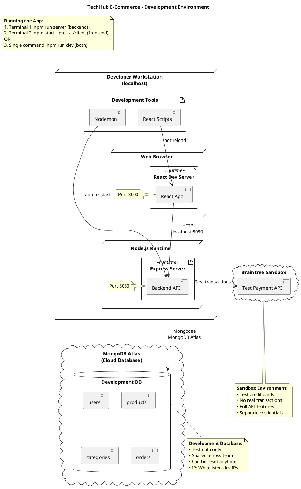
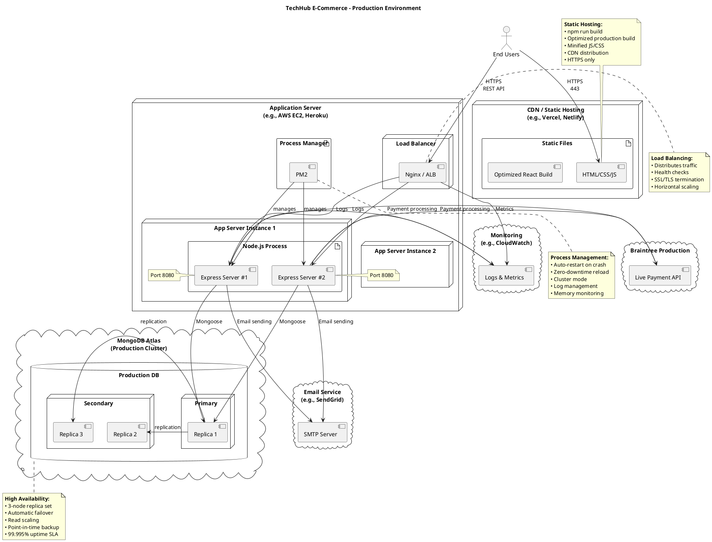
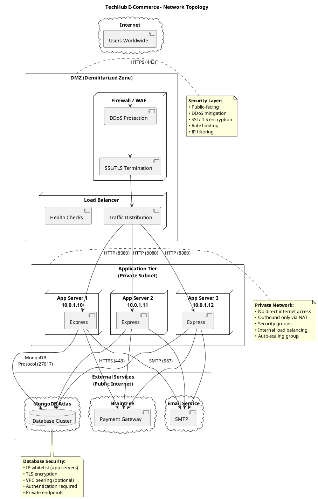
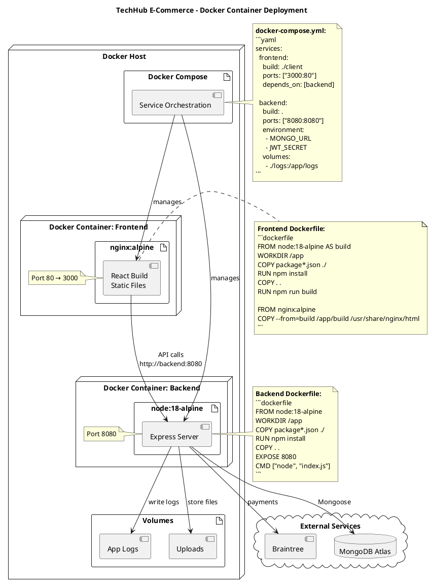
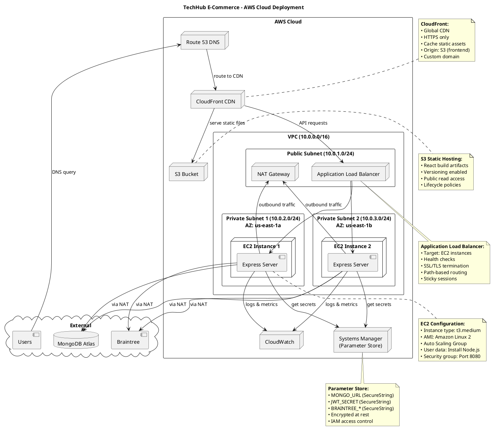

# Deployment Diagram - Infrastructure and Deployment

## Overview
This document contains Deployment Diagrams for the TechHub E-Commerce system. These diagrams show the physical deployment of software components on hardware nodes, network topology, and infrastructure configuration.

## Deployment Diagrams

### 1. Development Environment Deployment



### 2. Production Environment Deployment



### 3. Network Topology Diagram



### 4. Container Deployment (Docker - Optional)



### 5. Cloud Infrastructure Deployment (AWS Example)



## How to View These Diagrams

### In VS Code
1. Install "PlantUML" extension by jebbs
2. Copy each PlantUML code block
3. Create separate `.puml` files
4. Press `Alt+D` to preview

### Online
1. Go to: http://www.plantuml.com/plantuml/uml/
2. Copy code between \`\`\`plantuml tags
3. Paste and view

## Deployment Explanations

### 1. Development Environment

**Purpose:** Local development setup for developers.

**Components:**
- **React Dev Server** (Port 3000)
  - Hot module replacement
  - Source maps for debugging
  - Development mode warnings
  - Fast refresh

- **Express Server** (Port 8080)
  - Nodemon auto-restart
  - Detailed error messages
  - Console logging (Morgan)
  - Development mode

- **MongoDB Atlas** (Cloud)
  - Shared development database
  - Test data
  - Can be reset
  - IP whitelist for developers

- **Braintree Sandbox**
  - Test payment environment
  - Fake credit card numbers
  - No real transactions
  - Full API simulation

**Running Development:**
```bash
# Option 1: Run separately
Terminal 1: npm run server
Terminal 2: npm run client

# Option 2: Run concurrently
npm run dev
```

### 2. Production Environment

**Purpose:** Live production deployment for end users.

**Architecture:**
- **CDN / Static Hosting** (Frontend)
  - Serves optimized React build
  - Global CDN distribution
  - HTTPS enforced
  - Minified assets
  - Examples: Vercel, Netlify, S3 + CloudFront

- **Application Servers** (Backend)
  - Multiple instances (horizontal scaling)
  - Load balancer (Nginx / AWS ALB)
  - Process manager (PM2)
  - Auto-restart on failure
  - Zero-downtime deployment
  - Examples: AWS EC2, Heroku, DigitalOcean

- **MongoDB Atlas** (Database)
  - Production cluster
  - 3-node replica set
  - Automatic failover
  - Point-in-time backups
  - 99.995% uptime SLA

- **External Services**
  - Braintree Production API
  - Email service (SendGrid, AWS SES)
  - Monitoring (CloudWatch, DataDog)

**Deployment Process:**
```bash
# Frontend
cd client
npm run build
# Deploy build/ folder to static hosting

# Backend
git push heroku main
# OR
pm2 start index.js --name "techhub-api"
```

### 3. Network Topology

**Purpose:** Shows network layers and security zones.

**Network Layers:**

1. **DMZ (Demilitarized Zone)**
   - Public-facing layer
   - Firewall / WAF (Web Application Firewall)
   - DDoS protection
   - SSL/TLS termination
   - Load balancer

2. **Application Tier (Private Subnet)**
   - No direct internet access
   - Outbound via NAT gateway
   - Multiple app server instances
   - Private IP addresses (10.0.1.x)
   - Security groups restrict traffic

3. **External Services**
   - MongoDB Atlas (cloud database)
   - Braintree (payment gateway)
   - Email service (SMTP)
   - Accessed via HTTPS

**Security Measures:**
- ✅ Firewall rules
- ✅ SSL/TLS encryption
- ✅ Private subnets
- ✅ IP whitelisting
- ✅ DDoS protection
- ✅ Rate limiting
- ✅ Security groups

### 4. Container Deployment (Docker)

**Purpose:** Containerized deployment for consistency.

**Containers:**

1. **Frontend Container**
   - Base: nginx:alpine
   - Contains: React production build
   - Serves static files
   - Lightweight (~50MB)

2. **Backend Container**
   - Base: node:18-alpine
   - Contains: Express server
   - Node.js runtime
   - Dependencies included

**Benefits of Docker:**
- ✅ Consistent environments (dev = prod)
- ✅ Easy deployment
- ✅ Isolation
- ✅ Portability
- ✅ Orchestration with Docker Compose / Kubernetes

**Docker Compose Example:**
```yaml
version: '3.8'
services:
  frontend:
    build: ./client
    ports:
      - "3000:80"
    depends_on:
      - backend

  backend:
    build: .
    ports:
      - "8080:8080"
    environment:
      - MONGO_URL=${MONGO_URL}
      - JWT_SECRET=${JWT_SECRET}
    volumes:
      - ./logs:/app/logs
```

### 5. AWS Cloud Deployment

**Purpose:** Enterprise-grade cloud deployment on AWS.

**AWS Services Used:**

| Service | Purpose |
|---------|---------|
| **Route 53** | DNS management, domain routing |
| **CloudFront** | Global CDN for frontend |
| **S3** | Static file hosting (React build) |
| **ALB** | Application Load Balancer |
| **EC2** | Application servers (Express) |
| **VPC** | Virtual Private Cloud (networking) |
| **NAT Gateway** | Outbound internet for private subnets |
| **CloudWatch** | Logging and monitoring |
| **Systems Manager** | Secure parameter storage |
| **Auto Scaling** | Automatic scaling based on load |

**VPC Configuration:**
- **VPC CIDR**: 10.0.0.0/16
- **Public Subnet**: 10.0.1.0/24 (ALB, NAT)
- **Private Subnet 1**: 10.0.2.0/24 (AZ: us-east-1a)
- **Private Subnet 2**: 10.0.3.0/24 (AZ: us-east-1b)

**High Availability:**
- Multi-AZ deployment
- Auto Scaling Group
- Health checks
- Automatic failover
- Load balancing

**Security:**
- Private subnets for app servers
- NAT Gateway for outbound traffic
- Security groups restrict inbound
- Secrets in Parameter Store (encrypted)
- TLS in transit

## Deployment Checklist

### Pre-Deployment

- [ ] Environment variables configured
- [ ] Database connection tested
- [ ] SSL certificates obtained
- [ ] Domain DNS configured
- [ ] Payment gateway credentials (production)
- [ ] Email service configured
- [ ] Monitoring and logging setup
- [ ] Backup strategy defined

### Frontend Deployment

- [ ] Run `npm run build`
- [ ] Test production build locally
- [ ] Upload to static hosting / CDN
- [ ] Configure custom domain
- [ ] Enable HTTPS
- [ ] Test all routes work
- [ ] Verify API calls work

### Backend Deployment

- [ ] Install Node.js on server
- [ ] Clone repository
- [ ] Run `npm install`
- [ ] Set environment variables
- [ ] Test database connection
- [ ] Start with process manager (PM2)
- [ ] Configure reverse proxy (Nginx)
- [ ] Enable SSL/TLS
- [ ] Test all API endpoints
- [ ] Monitor logs

### Post-Deployment

- [ ] Smoke tests on production
- [ ] Performance testing
- [ ] Security scan
- [ ] Monitoring alerts configured
- [ ] Backup verification
- [ ] Documentation updated
- [ ] Team notified

## Deployment Environments

| Environment | Purpose | Database | Payments | URL |
|-------------|---------|----------|----------|-----|
| **Development** | Local coding | Dev DB (Atlas) | Sandbox | localhost:3000 |
| **Staging** | Pre-production testing | Staging DB | Sandbox | staging.techhub.com |
| **Production** | Live system | Production DB | Live | www.techhub.com |

## Scaling Strategy

### Vertical Scaling
- Upgrade EC2 instance types
- Increase MongoDB cluster tier
- Add more RAM/CPU

### Horizontal Scaling
- Add more EC2 instances
- Auto Scaling Group
- Load balancer distributes traffic
- MongoDB read replicas

### Caching Strategy
- CloudFront caching (frontend)
- Redis for session/cart data
- API response caching
- Database query caching

## Disaster Recovery

### Backup Strategy
- **Database**: Automatic daily backups (MongoDB Atlas)
- **Code**: Git version control
- **Configuration**: Infrastructure as Code (Terraform, CloudFormation)
- **Media**: Product images in database

### Recovery Procedures
1. **Database Restore**: Restore from MongoDB Atlas backup
2. **Application**: Deploy from Git repository
3. **Configuration**: Apply infrastructure code
4. **Verification**: Run smoke tests

### RTO (Recovery Time Objective): < 2 hours
### RPO (Recovery Point Objective): < 24 hours

## Related Diagrams

- [COMPONENT_DIAGRAM.md](COMPONENT_DIAGRAM.md) - Shows software components deployed
- [SYSTEM_DESIGN.md](SYSTEM_DESIGN.md) - Shows system architecture
- [ARCHITECTURE_DIAGRAM.puml](ARCHITECTURE_DIAGRAM.puml) - High-level architecture

---

**Last Updated:** 2025-11-23
**Diagram Type:** UML Deployment Diagram
**Purpose:** Infrastructure, Deployment, and Network Architecture
